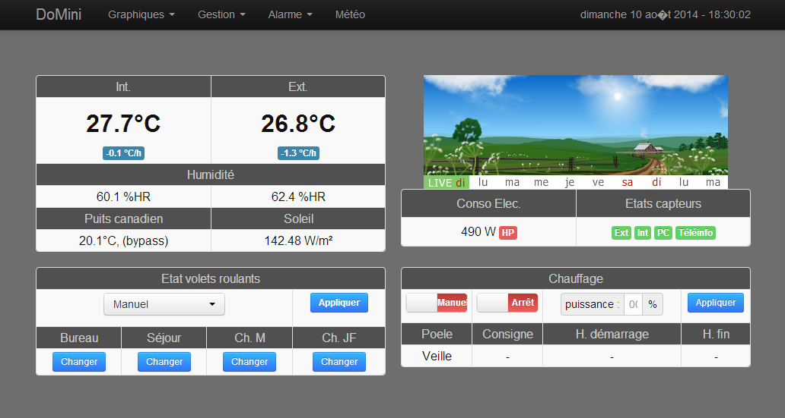
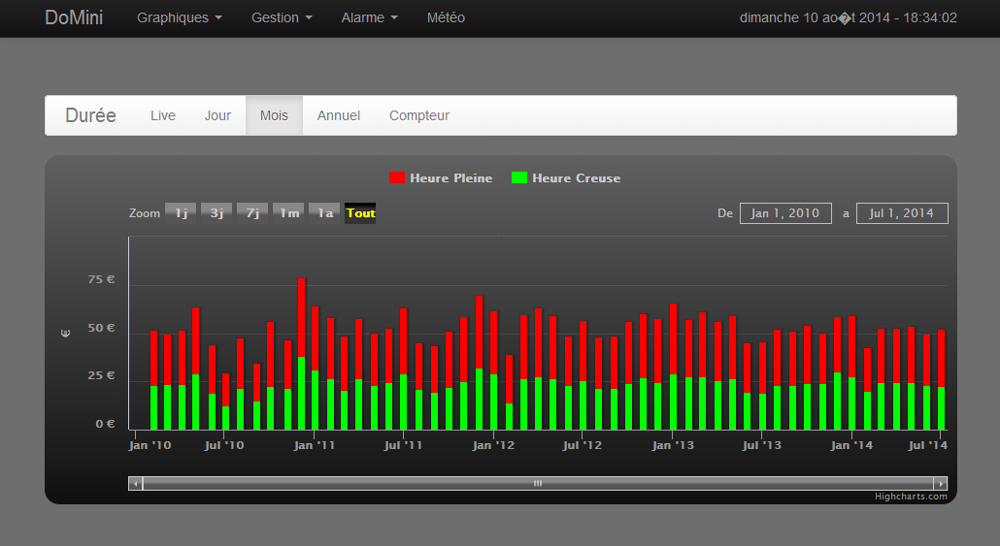

Domini
======

Mon projet domotique / My Home automation project

((BROUILLON))

#Demo
A l'adresse suivante, une version 'demo' de l'interface web de ma domotique est visible.
http://minbiocabanon.free.fr/static_domini/
*Attention : les actions (boutons) et certaines pages renverront des erreurs car il n'y a pas de base de données qui tourne pour la démo. Il s'agit uniquement d'une 'photo instantanée' de mes données et interface que je mets à jour régulièrement.*

#Intro
Architecture de l'installation :

#Pré-requis
##Plateforme
Le serveur de la domotique est une machine Linux. 

Le projet ne nécessite que peu de ressources, jusqu'en aout 2014 il tournait sur un **Sheevaplug** :

- *Linux DEBIAN 6 Lenny*
- *ARM v5 1.2GHz*
- *RAM 512 Mo*
- *Flash 512 Mo* 
- *Lecteur SDCard (remplacé au bout de 6 mois par un disque dur USB car la SDCard ne supportait pas les nombreuses écritures)*
- *1 port USB*
- *1 port Ethernet*

Le projet Domini ayant atteint une certaine maturité et ayant acquis une place presque indispensable dans la maison (gestion du chauffage, volets et bientôt l'alarme) j'ai voulu fiabilisé le serveur.
Pour cela, j'ai migré du sheevaplug vers un **PC Barebone** (mon ancien PC recyclé) avec des disques dur montés en RAID1 et avec un peu plus de puissance pour réaliser les tâches (serveur web, sauvegarde base de données,...).

Voici les caractéristiques du PC (à titre d'information, cela n'indique pas le minimum nécessaire)

- *Linux DEBIAN 7*
- *PC x86 : Intel P4*
- *RAM : 2Go*
- *Disque dur : 2 x 80 Go ( montés en RAID1)*
- *1 port USB*
- *Wifi b/g/n*
- *Reseau Ethernet 10/100Mbps (optionnel une fois le wifi installé)*

#Paquets et logiciels
La liste des paquets installés sur ma machine est disponible sur le dépôt :

	~/serveur/systeme/dpkg.txt

Dans les grandes lignes voici ce qui est essentiel pour le projet :

- Serveur web : lighttpd
- Base de données : MySQL
- PHP
- GD (lib graphique pour HTML)
- serveur FTP : vsftp (pour récupération images des cameras IP)
- GCC (pour compiler les applications faites en C)
*Il existe certainement des dépendances ...*

Pour le développement, mise au point ou confort, j'utilise également :

- Samba
- Webmin
- Git
- screen

#Notes pour l'installation ou la migration vers un nouveau PC

## BASE DE DONNEES
la base de données tourne avec MySQL.

Fichier contenant la structure de la base :

	~/serveur/bdd/struct_domotique.sql
	
Fichier contenant l'exportation de toutes les données (non disponible sur le dépot git car du domaine privé)
L'importation de gros fichiers n'est pas possible via phpmyadmin, il faut utiliser mysql en ligne de commande:

 	mysql --user=root --password=mysql domotique < 	 ~/serveur/bdd/backup_domotique/backup-domotique.sql
 
## SYSTEME
### rc.local
Afin de garantir le fonctionnement de la domotique en cas de redémarrage intempestif du serveur (si pas d'onduleur ou à la reprise du courant lorsque l'onduleur est sec), il convient d'appeler le petit logiciel 'receiver' au démarrage.
Pour cela, il faut modifier le fichier rc.local en ajoutant ces quelques lignes à la fin du fichier (avant exit 0) :

	éditer le fichier (avec nano ou vi):
	nano /etc/rc.local

puis ajouter **avant exit 0**:

	#setting baudrate
	stty -F /dev/ttyUSB0 57600&
	echo "running receiver"
	/home/julien/bin/receiver /dev/ttyUSB0&
	echo "exiting from rc.local"

### Crontab:
Importer les taches CRON listées dans ce fichier :

	~/serveur/systeme/crontab.txt
	
Commande à éxécuter :

	crontab crontab.txt

## Logiciel
 - Modifier le fichier suivant pour y renseigner les identifiants de connexion à la base de données ainsi que le nom de la table:

	~/serveur/include/passwd.h
	
 - Recompiler tous les logiciels directement sur la cible avec la commande 'make'
 
## INTERFACE WEB
Faire un lien symbolique de ~/serveur/www/domini vers /var/www/domini

	ln -s ~/serveur/www/domini /var/www/domini

**ATTENTION** : il ne faut pas avoir créé /var/www/domini avant de créér le lien symbolique

ajouter le multihost dans lighttp.conf

	 ### Ajout virtual host Webcam ###
	$SERVER["socket"] == ":82" {
	 server.document-root = "/var/www/webcam/"
	 server.errorlog = "/var/log/lighttpd/webcam/error.log"
	 }

### BOOTSTRAP
le framework [bootstrap](http://getbootstrap.com/) est utilisé pour la création des pages web.
Cela permet d'avoir une IHM 'responsive', c'est à dire qui s'adapte en fonction du support (PC, smartphone, tablette...).
Il existe pleins de plugins pour bootstrap afin de compléter l'ergonomie de l'interface web : boutons, slider, calendrier, curseurs ...

### HIGHSTOCK
J'ai utilisé [Highstock](http://www.highcharts.com/) pour générer les graphiques. basé sur du javascript, les graphiques sont bien faits et personnalisables à volonté.

### Captures d'écran / Screenshots

